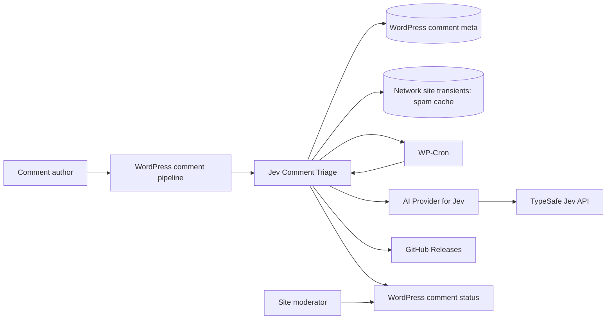
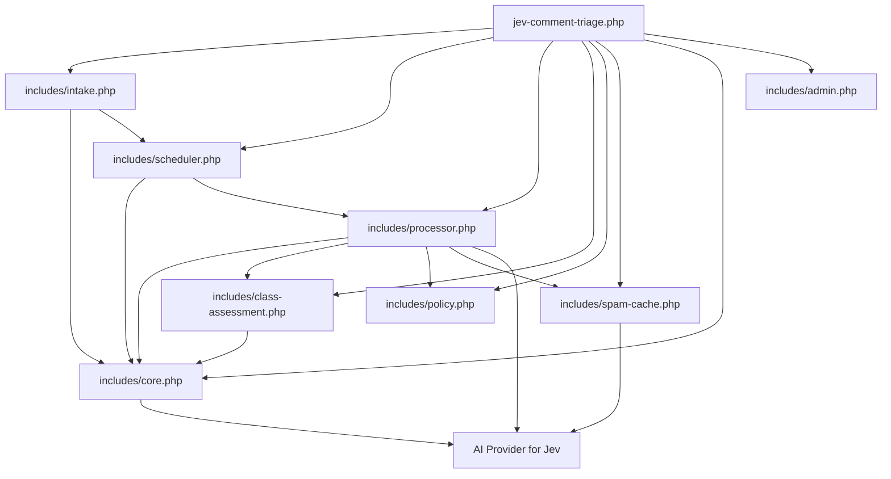

# Architecture

## Purpose

Jev Comment Triage is a WordPress plugin that holds eligible visitor comments,
judges them asynchronously with TypeSafe's Jev model through AI Provider for
Jev, and then routes them to approved, held, or spam status. The design keeps the
remote model call off the comment-submission request and preserves WordPress's
own moderation decision as an upper bound on what the plugin may publish.

This document describes the current implementation in `jev-comment-triage.php`
and the focused modules under `includes/`.

## Scope

Included:

- Selecting which comments enter AI triage.
- Deferring publication and retaining WordPress's original moderation decision.
- Scheduling, batching, locking, retrying, and processing background work.
- Constructing and validating three Jev judgments per comment (a relevance
  Choice and spam and abuse Nouls) and batching them per post.
- Mapping those judgments to WordPress comment statuses with thresholds that
  rise with the cost of a wrong action.
- Caching confident spam verdicts across the network and skipping calls when
  the answer is already known.
- Persisting triage state in comment metadata.
- Displaying results and registering privacy and operational notices.

Not included:

- API credentials, HTTP transport, model selection, and provider configuration;
  AI Provider for Jev owns those responsibilities.
- WordPress's native comment blocklist and moderation policy.
- A synchronous or interactive moderation user interface.
- Deleting spam or held comments.

## System context

The TypeSafe call crosses an external-service trust boundary. Comment text, post
title and content, link count, and optionally author details leave WordPress
through `AiProviderForJev\evaluate()`. The `jct_include_author_details` filter can
exclude author name, email, and URL, but it does not exclude the comment or post.
The updater separately checks this repository's public GitHub releases every
six hours and installs the matching `jev-comment-triage.zip` asset.

## Major modules

`jev-comment-triage.php` is the composition root: it defines shared constants,
loads each module, initializes the updater, and registers every WordPress hook.
Implementations live in focused files under `includes/`.

| Module | Implementation | Responsibility | Primary interface |
|---|---|---|---|
| Composition root | `jev-comment-triage.php` | Defines constants, loads modules, initializes updates, and registers hooks | WordPress hooks |
| Shared helpers | `includes/core.php` | Provider readiness, payload shaping, counting, and eligibility helpers | Namespaced helper functions |
| Intake | `includes/intake.php` | Holds eligible comments, captures WordPress's decision, and persists queue markers | `defer()`, `enqueue()` |
| Scheduler | `includes/scheduler.php` | Registers the minute interval, schedules work, selects a bounded batch, and limits overlap | `add_schedule()`, `ensure_scheduled()`, `drain()` |
| Assessment | `includes/class-assessment.php` | Constructs Jev requests, validates answers, and isolates request-body rejections | `Assessment::assess()` |
| Decision policy | `includes/policy.php` | Applies risk-scaled thresholds to normalized judgments | `thresholds()`, `decide()` |
| Processor | `includes/processor.php` | Batches comments, applies rules/cache, records retries, persists assessments, and changes status | `process_comments()` |
| Spam cache | `includes/spam-cache.php` | Keys confident spam verdicts and atomically records network-wide counters | Cache helper functions |
| Administration | `includes/admin.php` | Displays results and registers privacy and cron notices | WordPress admin callbacks |
| Cleanup | `uninstall.php` | Removes schedules, transients, options, and plugin-owned metadata | WordPress uninstall entry point |

The plugin has one production entry point. Most modules preserve the existing
namespaced function interfaces; assessment uses an injected class interface.
There is no dependency container.

## Runtime wiring and dependency direction

WordPress loads `jev-comment-triage.php`, which loads Composer dependencies
when available, initializes the GitHub updater, requires every module, and then
registers hooks. Module files do not register hooks themselves. This keeps
WordPress integration visible in one composition root and lets unit tests call
module functions directly.

The runtime dependency direction is:

`processor.php` is the orchestration boundary: it creates the production
`Assessment` with an adapter around `AiProviderForJev\evaluate()`. Tests can
inject a different `Assessment`, and `Assessment` itself depends only on its
callable adapter, root constants, and payload shaping from `core.php`. Provider
configuration checks live in `core.php`; cache keys read the configured model
in `spam-cache.php`.

The root defines constants before requiring modules, and requires dependencies
before their consumers. Because the function modules are not Composer
autoloaded, changing this order or loading a module independently can leave
constants, classes, or called functions unavailable. New runtime wiring and
hook registration belong in the composition root; leaf modules should not
require sibling files or register hooks as a side effect.

## Domain terms and persisted state

### Base decision

The status WordPress would have applied before this plugin deferred the comment:

- `"1"` means WordPress would approve.
- `"0"` means WordPress would hold.

`defer()` captures this value in a request-local registry. `enqueue()` persists
it as `_jct_base`.

### Pending comment

A held comment with `_jct_pending` metadata and no `_jev_triage` metadata. This
is the only shape selected by `drain()`.

### Assessment

The result stored under `_jev_triage` after processing (`version` 2):

- `source`: `jev` (asked), `cache` (known spam text), or `rule` (short comment).
- `relevance`: for `jev`, the Choice answer — `choice` (`on_topic`,
  `off_topic`, or `unclear`), `confidence` (0–1), and `probabilities`.
- `spam` and `abusive`: Noul probabilities (0–1) for `jev` and `cache`.
- `link_count`: number of detected links in the comment.
- `decision`: `"spam"`, `"1"`, or `"0"`.

Assessments written by version 1.4.0 have no `version` key and a different
shape; the admin column labels them as from an earlier version.

### Spam cache entry

A site transient named `jct_spam_` plus an MD5 of schema version, model, the
per-install salt, and the JSON of the exact `comment_payload()` sent to Jev:
content (with any link markup), link count, and — unless
`jct_include_author_details` is off — author name, URL, and email. Two
submissions that differ in anything the spam question can read never share a
verdict. The post is deliberately excluded: the cache exists to recognise the
same submission replayed on other posts and sites, only verdicts of at least
`0.98` are stored, and shadow mode's `agreed` counter measures whether a
verdict holds on another post before the cache is enabled. An entry holds only
`version`, `spam`, and `abusive` and expires after seven days. Relevance is
never cached, because it depends on the post.

The `jct_spam_cache_salt` site option is created on first use. Uninstall
deletes it, which orphans every earlier verdict wherever it is stored —
including a persistent object cache that uninstall cannot enumerate — so a
reinstall never reuses them.

### Retry count

`_jct_attempts` records failed assessment attempts. The plugin stops automatic
processing after three failures by removing `_jct_pending`, leaving the comment
held for a moderator.

### Lifecycle

| State | Persisted shape and status | Allowed next states |
|---|---|---|
| Excluded | No plugin metadata; WordPress-selected status | Managed by WordPress or another plugin |
| Deferred | Status `hold`; `_jct_pending` and `_jct_base` exist | Processing, retry waiting |
| Retry waiting | Status `hold`; pending/base metadata exist; attempts incremented | Processing, abandoned hold |
| Approved | Status `approve`; `_jev_triage` with `source` `jev` exists; pending/base removed | Managed by WordPress or a moderator |
| Spam | Status `spam`; `_jev_triage` exists; pending/base removed | Managed by WordPress or a moderator |
| Moderation queue | Status `hold`; `_jev_triage` exists; pending/base removed | Managed by a moderator |
| Abandoned hold | Status `hold`; pending removed after the third failure; no result metadata | Managed by a moderator |

The current implementation retains `_jct_attempts` after later success and
retains `_jct_base` and `_jct_attempts` after abandonment. Uninstall removes all
plugin-owned metadata.

## Comment submission flow

Trigger: WordPress processes a new comment.

1. WordPress and other moderation plugins compute an approval status.
2. The `pre_comment_approved` filter calls `defer()` at `PHP_INT_MAX`, so it sees
   the effective decision after earlier filters.
3. `defer()` returns the original decision without triage when:
   - the provider is unavailable or unconfigured;
   - the value is a `WP_Error`;
   - the item is a pingback or trackback;
   - the author can `moderate_comments`; or
   - WordPress already selected spam or trash.
4. For an eligible comment, `defer()` records `"1"` or `"0"` in
   `base_registry()` under a fingerprint and returns `"0"`. No remote request is
   made in this path.
5. After WordPress stores the held comment, the `comment_post` action calls
   `enqueue()` with its comment ID.
6. `enqueue()` repeats the eligibility checks, reads the captured base decision
   (defaulting to `"0"` if no registry entry matches), and adds `_jct_pending`
   and `_jct_base`.
7. `enqueue()` ensures the recurring drain exists. It may also schedule an
   immediate `jct_drain` event and call `spawn_cron()`. The `jct_drain_soon`
   transient limits these nudges to one every 15 seconds.

The fingerprint is an in-request handoff key derived from post ID, author email,
and comment content. It is not a persistent idempotency key.

## Background triage flow

Trigger: the recurring or immediate `jct_drain` WP-Cron event.

1. `drain()` exits when the provider is unavailable or the `jct_draining`
   transient already exists.
2. It sets a ten-minute lock transient and selects up to `jct_batch_size`
   comments, default 20, ordered oldest first.
3. The query includes only held comments that have `_jct_pending` and do not
   have `_jev_triage`.
4. `process_comments()` groups the batch by post, reads each post once, and
   splits each group into chunks of `jct_comments_per_request` (default 20).
5. For each comment, `process_chunk()` reads the base decision, then:
   - empty content removes pending/base metadata and applies the base decision;
   - with `jct_min_words` above zero, a link-free comment with fewer words is
     stored with `source` `rule` and held, without a call;
   - a spam-cache hit is counted. With `jct_spam_cache` enabled the cached
     verdict is applied without a call; otherwise the comment is still sent to
     Jev (shadow mode).
6. The remaining comments in the chunk go to `Assessment::assess()` in **one**
   request:
   the post title and content are the shared state, and every comment adds
   three questions whose `instructions` object carries that comment (content,
   link count, and optional author details).
7. The `Assessment` implementation validates each comment's three answers on
   its own: a known relevance choice, confidence and every probability within
   `0..1`, all relevance options present, and numeric Noul values within
   `0..1`.
8. If Jev rejects the request (HTTP 413 or 422 — the statuses for a rejected
   body), `Assessment::assess()` splits the chunk in half and retries each half
   until the offending comment stands alone. Outages, timeouts, auth or
   configuration errors (such as 404), and rate limits are not split. Each
   comment whose
   own request failed, or whose answers are invalid, calls `record_failure()`. Attempts one and two
   remain pending for a later drain. At attempt three, it removes
   `_jct_pending` and leaves the comment held.
9. A valid spam probability of at least `0.98` writes a spam-cache entry.
10. `apply_assessment()` calls `decide()`, which checks, in order:
    - spam ≥ `spam` threshold (0.90) returns spam;
    - abusive ≥ `abusive` threshold (0.50) returns hold;
    - `on_topic` with confidence ≥ `relevance` (0.80), and spam and abusive
      both below `clean` (0.20), returns the base decision;
    - everything else returns hold.
11. It stores the assessment and decision in `_jev_triage`, removes
    pending/base metadata, updates the status through `finalize()`, and fires
    `jct_triaged`.
12. `record_cache_stats()` adds this run's cache counters to the
    network-wide counters with one atomic SQL increment each, and a `finally`
    block removes the lock.

## Boundaries and constraints

### Publication invariant

The plugin must not publish a comment that WordPress would have held.

Enforced by:

- `defer()`, which captures the base decision and temporarily holds the comment.
- `decide()`, which returns the base decision only for a confident, clean
  `on_topic` result and otherwise returns spam or hold.
- `process_chunk()`, which defaults a missing or unexpected base value to
  `"0"`.

Verified by:

- `tests/Unit/DeferTest.php`.
- The "respects WordPress moderation" case in `tests/Unit/LogicTest.php`.
- The "holds a clean comment when WordPress would moderate" case in
  `tests/Unit/ProcessCommentTest.php`.

### Fail-closed invariant

Uncertainty and provider failure must not make a comment public.

Enforced by:

- `decide()`, which holds abusive, borderline, low-confidence, off-topic,
  unclear, and default cases, and holds any assessment without judgments.
- `Assessment::assess()`, whose private parser converts each malformed or
  missing answer to `WP_Error`.
- `process_chunk()` and `record_failure()`, which leave failed comments held
  and retry at most three times, per comment.
- The spam cache, which can only ever produce a spam or hold decision.

Verified by low-confidence, API-error, and malformed-response cases in
`tests/Unit/LogicTest.php` and `tests/Unit/ProcessCommentTest.php`.

### Asynchronous boundary

The comment-submission request may write metadata and schedule work but must not
call TypeSafe. The external call exists only behind `Assessment::assess()`,
reached from `process_chunk()` during the cron drain.

### Persistence boundary

WordPress comment rows own the public moderation status. WordPress comment meta
owns queue, retry, base-decision, and assessment state. There is no custom table
and no database transaction spanning metadata writes and status changes.

### Concurrency and idempotency

The `jct_draining` transient is a best-effort process lock with a ten-minute
lease. The check and set are separate operations, so it is not an atomic lock.
The drain query excludes comments with `_jev_triage`, and metadata writes use
unique insertion where applicable, but assessment persistence, marker deletion,
and status changes are not transactional. Changes must not assume exactly-once
processing. With batching, an overlapping drain repeats a whole request rather
than one comment; `enqueue()`'s `spawn_cron()` loopback is a real source of a
second drain process.

### Trust and privacy

- Comment and post text are untrusted application data sent to an external
  model for bounded, typed judgments. Each comment sits inside its own
  questions rather than in shared state, and the live fixtures include a
  prompt-injection attempt, which was routed to spam.
- The private parser behind `Assessment::assess()` validates every answer before
  policy code consumes it.
- The spam cache stores a salted hash and two probabilities, not comment text
  or author details.
- Author PII is included by default and can be excluded with
  `jct_include_author_details`.
- API credentials remain in AI Provider for Jev and are not owned by this
  plugin.

## Public extension points

| Hook | Contract |
|---|---|
| `jct_thresholds` | Filters `spam`, `abusive`, `relevance`, and `clean` thresholds; receives the assessment as its second argument. Values are merged over `DEFAULT_THRESHOLDS`; missing or nonnumeric keys fall back to the default, and all values are clamped to `0..1`. The 1.4.0 filter of the same name also used a `spam` key with the same meaning; its other keys are ignored. |
| `jct_batch_size` | Filters the maximum number of comments selected by one drain. |
| `jct_comments_per_request` | Filters how many comments on one post share a Jev request (minimum 1). |
| `jct_spam_cache` | Return `true` to apply cached spam verdicts without calling Jev. Default `false` (shadow mode). |
| `jct_min_words` | Holds link-free comments with fewer words without calling Jev. Default `0` (off). |
| `jct_include_author_details` | Controls whether name, email, and URL are included in Jev state. |
| `jct_triaged` | Fires after every stored decision (from Jev, the cache, or the short-comment rule) with comment ID, assessment, and decision. It does not fire for empty comments, retries, or abandoned comments. |

## Operational behavior

- `ensure_scheduled()` creates the recurring event only while the provider is
  ready.
- Deactivation unschedules `jct_drain`.
- `uninstall.php` clears the schedule, both transients, all four
  plugin-owned comment-meta keys, the cache salt (orphaning every cached
  verdict), the database-stored cache entries, and the cache counters.
- The `jct_spam_cache_stats_lookups`, `_hits`, and `_agreed` site options, read
  together with `cache_stats()`, are the evidence for enabling
  `jct_spam_cache`: `agreed` / `hits` is how often Jev confirmed a cached
  verdict. Each is its own row, incremented in SQL, because drains on
  different sites do not share a lock.
- `cron_notice()` warns administrators on the Comments and Plugins screens when
  `DISABLE_WP_CRON` is enabled. Supplying a real system cron remains an
  operational responsibility outside the plugin.
- The plugin entry point loads production Composer dependencies and initializes
  the GitHub updater for the public repository, the `main` branch, and a
  six-hour check period.
- Both release workflows install production dependencies, filter the repository
  through `.distignore`, build a `jev-comment-triage/`-rooted ZIP, verify its
  runtime dependencies, and attach `jev-comment-triage.zip` to a GitHub release.

## Testing architecture

Pest runs through Composer using `composer test`. Assessment tests inject an
in-memory provider adapter directly into the module. Orchestration tests use
Brain Monkey to replace WordPress functions and the production provider
adapter, while `tests/bootstrap.php` supplies the minimal WordPress classes and
constants needed to load the production entry point.

| Test file | Architectural responsibility |
|---|---|
| `tests/Unit/AssessmentTest.php` | Assessment interface, typed question construction, normalized keyed results, per-comment validation, and 413/422 isolation |
| `tests/Unit/DeferTest.php` | Eligibility, deferral, and preservation of WordPress decisions |
| `tests/Unit/LogicTest.php` | Link and word counting, cache-key sensitivity to every spam-visible field and to salt rotation, decision policy, threshold merging, and trusted-user checks |
| `tests/Unit/ProcessCommentTest.php` | Request shape, outcomes per judgment, per-post batching and chunking, per-comment retries, isolation of a comment that gets a request rejected, no splitting on outages or configuration errors, atomic counter SQL, spam cache (store, shadow, enabled), the short-comment rule, and the admin column text |

The tests are unit-level simulations. They do not verify real WP-Cron scheduling,
transient races, WordPress database behavior, provider HTTP behavior, or
activation/uninstall behavior.

### Manual end-to-end harness

`bin/benchmark.php` is a WP-CLI script (`wp eval-file`) that complements the
unit tests by driving the real path against a live install and a configured
provider. It creates a fixture post, submits 20 labelled comments per round
through `wp_new_comment()`, loops `drain()` until the backlog clears, and
reports submission latency, per-request latency and question count (timed at
the HTTP layer through `pre_http_request` and `http_api_debug`), input tokens,
expected-versus-actual routes, retry counts, cache counters, and whether the
publication invariant held. The fixtures include the hard cases that justify
separate judgments: abuse and threats about the post, promotion and phishing
that mention it, prompt injection, a legitimate documentation link, a
non-English comment, and civil criticism. To reach the publish path it
overrides `comment_moderation` through `pre_option_comment_moderation` in its
own process only, so the stored setting and concurrent visitors are never
affected. Cleanup (fixtures, cache entries, counters) runs from a shutdown
function as well as `finally`, because `WP_CLI::error()` exits without running
`finally`.

Two environment details the harness has to model explicitly, because they are
properties of how WordPress runs the drain in production rather than of the
plugin:

- WordPress flood control rejects rapid successive comments, so the submission
  phase filters `wp_is_comment_flood`.
- `enqueue()` nudges WP-Cron with a `spawn_cron()` loopback, which starts a
  second drain in another process. The harness suppresses the nudge by
  filtering `pre_transient_jct_drain_soon` in its own process, so it is the
  only drain and its counts are exact.
- Each WP-Cron tick is a separate request with a cold runtime cache. Looping
  `drain()` inside one long-lived CLI process leaves stale comment and comment
  meta entries in memory, which makes later passes appear to stall. The harness
  resets the runtime object cache between passes to match production.

## Where to make changes

| Change | Primary location | Also update |
|---|---|---|
| Change question wording or options | Private question schema in `includes/class-assessment.php` | bump `SCHEMA_VERSION` (invalidates cached verdicts), update assessment tests, `column_text()`, benchmark fixtures, README/readme |
| Change decision policy | `includes/policy.php` and `DEFAULT_THRESHOLDS` | logic/process tests, hook documentation; re-run `bin/benchmark.php` |
| Change spam-cache behavior | `includes/spam-cache.php` and cache use in `includes/processor.php` | cache tests, `uninstall.php`, privacy text |
| Change comment eligibility | `includes/intake.php` and helpers in `includes/core.php` | defer tests; keep defer/enqueue paths consistent |
| Change queued metadata or lifecycle | Constants, `includes/intake.php`, `includes/scheduler.php`, `includes/processor.php` | `uninstall.php`, process tests, this document |
| Change retry behavior | `MAX_ATTEMPTS` and `record_failure()` in `includes/processor.php` | process tests and lifecycle documentation |
| Change scheduling or batching | `includes/scheduler.php`, `includes/intake.php`, `includes/processor.php`, `COMMENTS_PER_REQUEST` | admin notice, operational docs, batching tests |
| Change data sent externally | `comment_payload()` in `includes/core.php` and `Assessment::assess()` | privacy-policy text, README/readme privacy sections, translation template |
| Change admin presentation | `includes/admin.php` | translation template when strings change |
| Change module wiring or WordPress hooks | `jev-comment-triage.php` | dependency diagram, affected module tests, activation/deactivation behavior |
| Change updater or release artifact behavior | Updater bootstrap, `.distignore`, and `.github/workflows/` | Composer dependencies, installation docs, and archive-content checks |

## Current limitations and open questions

- The transient lock is not atomic; overlapping drains remain possible under a
  race or after a lock expires during a long batch.
- Metadata and status updates are not transactional, and write results are not
  checked. A partial write can leave a comment outside the expected lifecycle.
- Retry/base metadata are retained after abandonment, and retry metadata is
  retained after eventual success.
- An outage, timeout, or rate limit counts an attempt for every comment in the
  chunk, so a long outage can use up attempts for many comments at once.
  Rejected bodies (413/422) are split to isolate the cause, which costs up to
  roughly two extra requests per level of splitting.
- Default thresholds were checked against 20 labelled fixtures on one post.
  They are a starting point; TypeSafe's guidance is to evaluate thresholds on
  the site's own comments.
- The spam cache's hit rate on real traffic is unknown; it ships in shadow mode
  so its counters can measure it first.
- There is no integration test against a real WordPress database, WP-Cron, or
  the configured AI Provider for Jev. The closest substitute is
  `bin/benchmark.php`, which exercises the full path end to end against a live
  provider but asserts nothing and is run manually.
